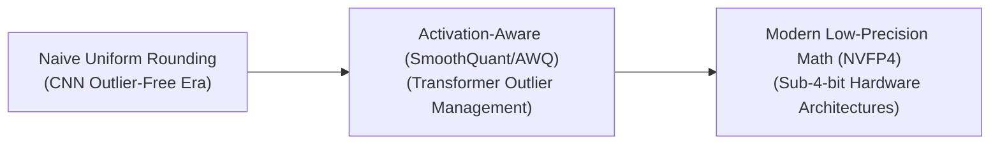

# Awesome-Post-Training-Quantization
## Post-Training Quantization (PTQ): Evolution, Variants, & Applications

Post-Training Quantization (PTQ) is a model compression framework that converts a fully trained deep learning network’s weights and activations from high-precision floating-point formats (such as FP32 or BF16) into lower-precision representations (like INT8, INT4, or FP4). Unlike Quantization-Aware Training (QAT), which mandates expensive retraining loops, PTQ takes a completed model and optimizes its parameter bit-width in hours or minutes using minimal calibration data.

---

## 1. The Chronological Evolution

The algorithmic progression of PTQ reflects a transition from simple rounding heuristics on convolutional neural networks (CNNs) to advanced optimization routines capable of squeezing massive Large Language Models (LLMs) down to ultra-low bit widths.

*   **The Flat Heuristic Era (Pre-2022)**
    *   *Concept:* Developed for smaller networks like ResNet. Applied basic, absolute scaling factors uniformly across layers without considering structural data outliers.
    *   *Limitation:* Suffered catastrophic accuracy failures when deployed on early emergent Transformers due to sudden, high-magnitude activation channels.
*   **The Activation-Aware & Hessian Optimization Era (~2022–2024)**
    *   *Concept:* Addressed systemic outlier channels. Algorithmic suites like **GPTQ** solved second-order Taylor expansions to counteract quantization errors rightward through matrices. Concurrently, methods like **AWQ** protected the top 1% most salient weight channels based on active runtime data distributions.
*   **Modern Low-Precision Hardware Convergence (~2025–Present)**
    *   *Concept:* Moves beyond standard integer bounds. Advanced pipelines exploit natively supported non-uniform hardware types—like **NVFP4** (4-bit floating point)—backed by multi-lingual calibration sets to preserve multi-token prediction and complex semantic dependencies.

---

## 2. Parameter Scope Variants

PTQ routines vary based on whether they optimize model parameters statically on disk, or address the dynamic operational data calculated at runtime.

*   **Weight-Only Quantization (W4A16 / W8A16)**
    *   *Mechanism:* Compresses the model weights to 4-bit or 8-bit integers while keeping the active layer activations in their native 16-bit precision (FP16 or BF16).
    *   *Pros:* Drastically lowers VRAM requirements on disk. Parameters are de-quantized on-the-fly back to floating-point values in SRAM during execution, protecting arithmetic accuracy.
*   **Weight-Activation Quantization (W8A8 / W4A4)**
    *   *Mechanism:* Fully forces both weights and dynamic system activations into lower-precision formats simultaneously.
    *   *Pros:* Unlocks high computational throughput by substituting expensive floating-point arithmetic with lightning-fast, native integer-to-integer matrix multiplications on tensor cores.

---

## 3. Mathematical Matrix Granularities

How quantization boundaries are mapped across data tensors defines the trade-off between model processing speed and accuracy preservation.

*   **Per-Tensor Quantization**
    *   *Mechanism:* Computes a single, global scaling factor and zero-point offset for an entire multi-dimensional weight matrix.
    *   *Pros:* Computationally lightweight and fast for hardware to parse.
    *   *Cons:* Susceptible to heavy degradation if the tensor contains an uneven spread of values.
*   **Per-Channel Quantization**
    *   *Mechanism:* Assigns a unique, localized scaling parameter to each row or column within the tensor independently.
    *   *Pros:* Provides high mathematical resolution, preserving performance by isolating localized activation ranges.
*   **Group-Wise (Block) Quantization**
    *   *Mechanism:* Partitions parameter tensors into small, fixed blocks (typically a group size of 32, 64, or 128 elements). Each block receives independent scale configurations.
    *   *Status:* The underlying architecture behind cross-platform frameworks like GGUF.

---

## 4. Modern Core Algorithmic Frameworks

*   **GPTQ (Generalized Post-Training Quantization)**
    *   *Type:* Inverse-Hessian Optimization.
    *   *Mechanism:* Analyzes a small calibration dataset to measure the output deviation of a layer. It rounds weights sequentially, modifying adjacent unquantized weights to correct the newly introduced numerical error.
*   **AWQ (Activation-Aware Weight Quantization)**
    *   *Type:* Salient Weight Protection.
    *   *Mechanism:* Measures activation distributions to identify critical weight groups. Instead of keeping those critical channels in expensive FP16, it scales up those salient channels before uniform quantization, reducing overall distortion.
*   **SmoothQuant**
    *   *Type:* Migration-Based Activation Smoothing.
    *   *Mechanism:* Addresses the persistent mathematical challenge of activation outliers by mathematically migrating the quantization difficulty from activations over to weights via a scaling transformation.

---

## 5. Production Infrastructure Deployments

*   **Edge & Mobile Device Engine Execution**
    *   *Application:* Utilizing frameworks like `llama.cpp` and advanced **i-quants** (Importance Quantization) inside GGUF files to load and run 8B+ parameter models locally on consumer laptop CPUs or mobile chipsets.
*   **High-Volume Production LLM Serving Pipelines**
    *   *Application:* Cloud optimization systems (like TensorRT-LLM or vLLM) implement 4-bit and 8-bit PTQ recipes to quadruple concurrent user capacity on cloud infrastructure without purchasing additional enterprise GPUs.
*   **Automotive TinyML Microcontrollers**
    *   *Application:* Compresses small convolutional perception or sensor networks to 8-bit or lower integers to run on low-power vehicle hardware lacking specialized floating-point computing arrays.
