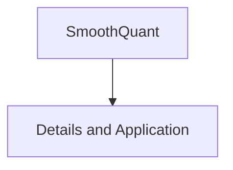

# SmoothQuant

## Overview
This page provides detailed information about SmoothQuant.

## Diagram

```mermaid
graph TD;
    A[SmoothQuant] --> B[Details and Application];
```

[Back to README](../README.md)
